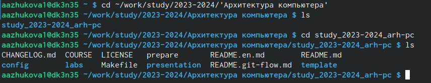

---
## Front matter
title: "Лабораторная работа №2"
subtitle: "Система контроля версий Git"
author: "Арина Александровна Жукова"

## Generic otions
lang: ru-RU
toc-title: "Содержание"

## Bibliography
bibliography: bib/cite.bib
csl: pandoc/csl/gost-r-7-0-5-2008-numeric.csl

## Pdf output format
toc: true # Table of contents
toc-depth: 2
lof: true # List of figures
lot: true # List of tables
fontsize: 12pt
linestretch: 1.5
papersize: a4
documentclass: scrreprt
## I18n polyglossia
polyglossia-lang:
  name: russian
  options:
	- spelling=modern
	- babelshorthands=true
polyglossia-otherlangs:
  name: english
## I18n babel
babel-lang: russian
babel-otherlangs: english
## Fonts
mainfont: PT Serif
romanfont: PT Serif
sansfont: PT Sans
monofont: PT Mono
mainfontoptions: Ligatures=TeX
romanfontoptions: Ligatures=TeX
sansfontoptions: Ligatures=TeX,Scale=MatchLowercase
monofontoptions: Scale=MatchLowercase,Scale=0.9
## Biblatex
biblatex: true
biblio-style: "gost-numeric"
biblatexoptions:
  - parentracker=true
  - backend=biber
  - hyperref=auto
  - language=auto
  - autolang=other*
  - citestyle=gost-numeric
## Pandoc-crossref LaTeX customization
figureTitle: "Рис."
tableTitle: "Таблица"
listingTitle: "Листинг"
lofTitle: "Список иллюстраций"
lolTitle: "Листинги"
## Misc options
indent: true
header-includes:
  - \usepackage{indentfirst}
  - \usepackage{float} # keep figures where there are in the text
  - \floatplacement{figure}{H} # keep figures where there are in the text
---
# Цель работы

Изучение идеологии и применение средств контроля версий. Приобретение
практических навыков по работе с системой git.

# Выполнение лабораторной работы

## Настройка github.

Создадим учётную запись на сайте https://github.com/ и заполним основные данные
(рис. 2.1).

{#fig:001 width=70%}

##  Базовая настройка git

Сделаем предварительную конфигурацию git. Откроем терминал и введем команды git config –global user.name и git config –global user.email, указав имя и email владельца репозитория(рис. 2.2). 

{#fig:002 width=70%}

Настроим utf-8 в выводе сообщений git (рис. 2.3). 

{#fig:003 width=70%}

Задаём имя начальной ветки (рис. 2.4).

{#fig:004 width=70%}

Настраиваем параметры autocrlf и safecrlf (рис. 2.5). 

{#fig:005 width=70%}

##  Создание SSH ключа

Сгенерируем приватный и открытые ключи для последующей идентификации пользователя на сервере репозиториев и скопируем его из локальной сети в буфер обмена (рис. 2.6). 

{#fig:006 width=70%}

Загружаем сгенерённый открытый ключ под именем Title (Рис. 2.7).

{#fig:007 width=70%}

##  Создание рабочего пространства и репозитория курса на основе шаблона

Организуем структуру рабочего пространства путём создания каталога для предмета «Архитектура компьютера» (рис. 2.8).

{#fig:008 width=70%}

## Создание репозитория курса на основе шаблона 

Создадим репозиторий курса на основе шаблона через web-интерфейс github (рис. 2.9). 

{#fig:009 width=70%}

Перейдём в каталог курса (рис. 2.10).

{#fig:010 width=70%}

Произведём клонирование репозитория и проверим корректность выполненной команды (рис. 2.11-2.12). 

{#fig:011 width=70%}

{#fig:011 width=70%}

##  Настройка каталога курса

Перейдём в каталог курса и удалим ненужные файлы (рис. 2.13)

{#fig:012 width=70%}

Cоздаём необходимые каталоги (рис. 2.14).

{#fig:013 width=70%}

Отправляем файлы на сервер (рис. 2.15-2.16).

{#fig:014 width=70%}

{#fig:015 width=70%}

Проверяем правильность создания иерархии рабочего пространства в локальном репозитории и на странице github (рис 2.17-2.18)

{#fig:016 width=70%}

{#fig:017 width=70%}

##  Задания для самостоятельной работы
Выгрузка отчета лабораторной работы №1 и лабораторной работы №2 на github (рис. 2.19-2.20).

{#fig:018 width=70%}

{#fig:019 width=70%}

# Вывод

В ходе выполнения лабораторной работы были изучены идеология и применение средств контроля версий, были приобретены практические навыки по работе с системой github.

