---
## Front matter
title: "Лабораторная работа №3"
subtitle: "Язык разметки Markdown"
author: "Арина Александровна Жукова"

## Generic otions
lang: ru-RU
toc-title: "Содержание"

## Bibliography
bibliography: bib/cite.bib
csl: pandoc/csl/gost-r-7-0-5-2008-numeric.csl

## Pdf output format
toc: true # Table of contents
toc-depth: 2
lof: true # List of figures
lot: true # List of tables
fontsize: 12pt
linestretch: 1.5
papersize: a4
documentclass: scrreprt
## I18n polyglossia
polyglossia-lang:
  name: russian
  options:
	- spelling=modern
	- babelshorthands=true
polyglossia-otherlangs:
  name: english
## I18n babel
babel-lang: russian
babel-otherlangs: english
## Fonts
mainfont: PT Serif
romanfont: PT Serif
sansfont: PT Sans
monofont: PT Mono
mainfontoptions: Ligatures=TeX
romanfontoptions: Ligatures=TeX
sansfontoptions: Ligatures=TeX,Scale=MatchLowercase
monofontoptions: Scale=MatchLowercase,Scale=0.9
## Biblatex
biblatex: true
biblio-style: "gost-numeric"
biblatexoptions:
  - parentracker=true
  - backend=biber
  - hyperref=auto
  - language=auto
  - autolang=other*
  - citestyle=gost-numeric
## Pandoc-crossref LaTeX customization
figureTitle: "Рис."
tableTitle: "Таблица"
listingTitle: "Листинг"
lofTitle: "Список иллюстраций"
lotTitle: "Список таблиц"
lolTitle: "Листинги"
## Misc options
indent: true
header-includes:
  - \usepackage{indentfirst}
  - \usepackage{float} # keep figures where there are in the text
  - \floatplacement{figure}{H} # keep figures where there are in the text
---

# Цель работы

Целью работы является освоение процедуры оформления отчетов с помощью легковесного
языка разметки Markdown.

# Выполнение лабораторной работы

## Основная часть

Перейдём в каталог курса, сформированный при выполнении лабораторной работы №2. Обновим локальный репозиторий, скачав изменения из удалённого репозитория (рис. 2.1).

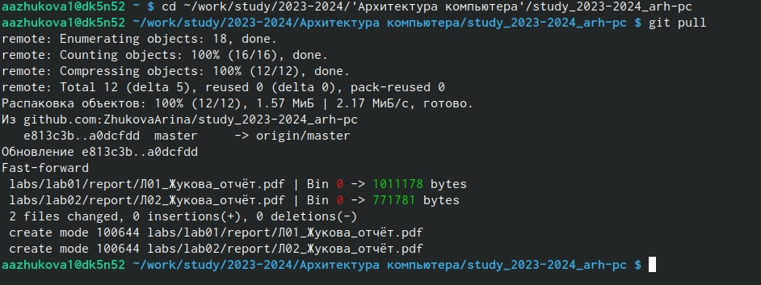{#fig:001 width=70%}

Проведём компиляцию шаблона с использованием Makefile в каталоге с шаблоном отчёта по лаборатонрой работе №3 (рис. 2.2).

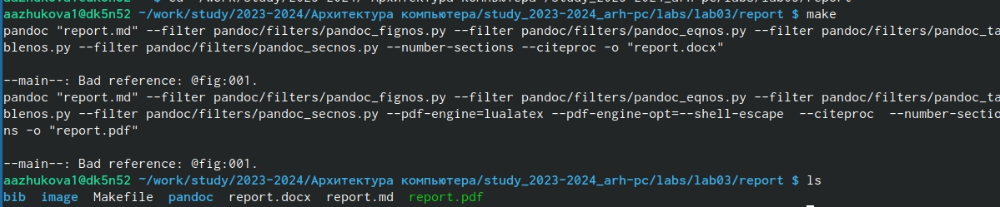{#fig:002 width=70%}

Проверяем корректность созданных файлов (рис. 2.3-2.44)

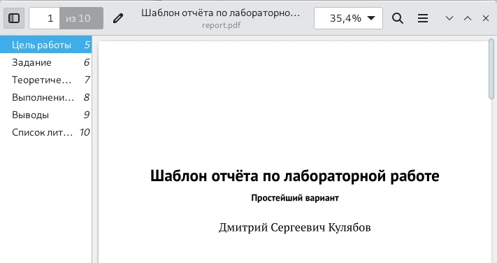{#fig:003 width=70%}

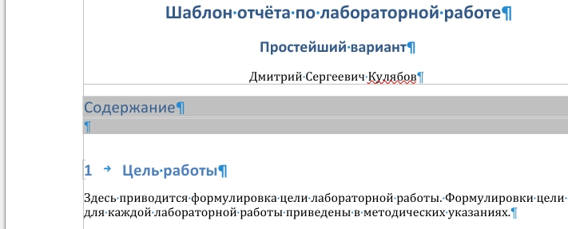{#fig:004 width=70%}

Удаляем полученные файлы с использоание Makefile, проверяем, что файлы были удалены (рис. 2.5).

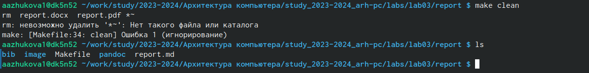{#fig:005 width=70%}

Открываем файл report.md с помощью текстового редактора и изучаем структуру этого файла (рис. 2.6).

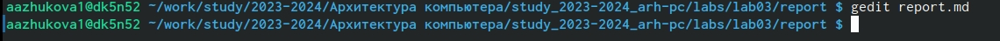{#fig:006 width=70%}

Заполняем и компилируем отчёт с использованием Markfile (рис. 2.7).

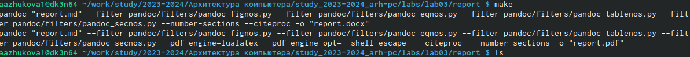{#fig:007 width=70%}

Проверяем корректность полученных файлов (рис. 2.8).

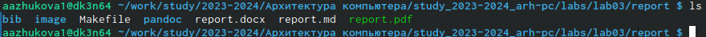{#fig:008 width=70%}

Загружаем файлы на GitHub. Проверяем наличие файлов (рис. 2.9-2.10).

!

!

## Задания для самостоятельной работы

Делаем отчёт по лабораторной работе №2 в формате Markdown (рис. 3.1-3.2).

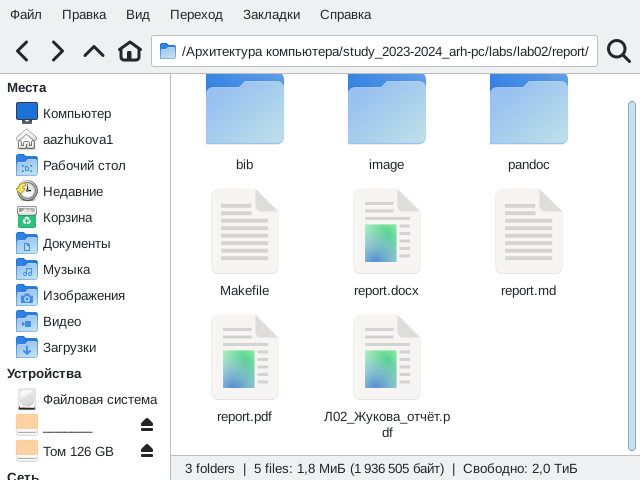{#fig:012 width=70%}

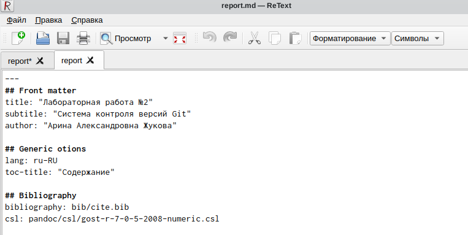{#fig:013 width=70%}

Загружаем файлы на GitHub. Проверяем наличие файлов (рис. 3.3).

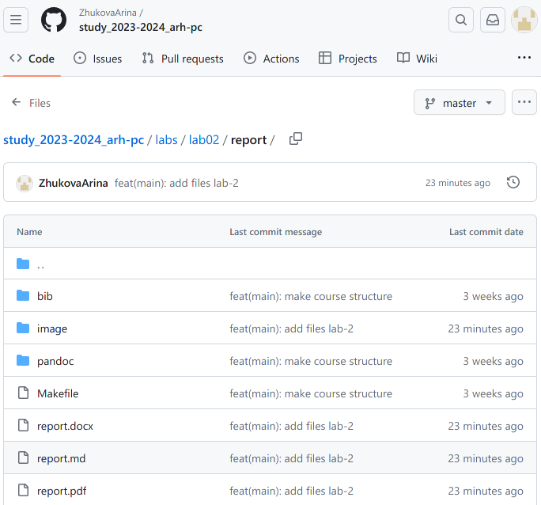{#fig:014 width=70%}

# Вывод

Во время выполнения данной лабораторной работы нами были освоены навыки работы с легковесным языком разметки Markdown с целью оформления отчётов.

