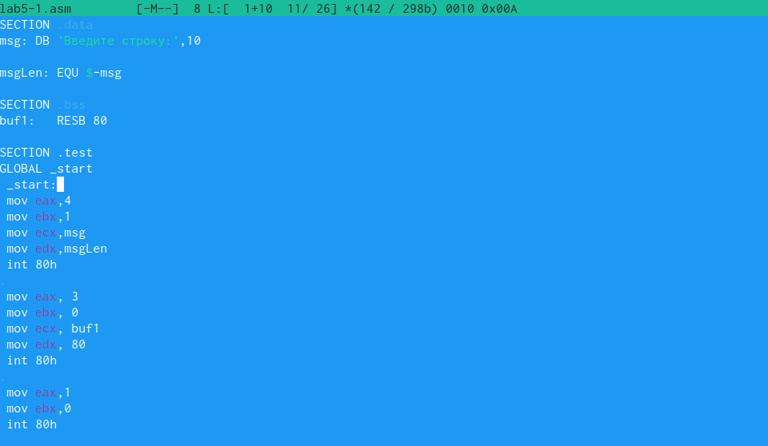
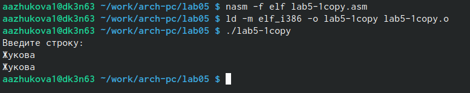

---
## Front matter
title: "Лабораторная работа №5"
subtitle: "Простейший вариант"
author: "Жукова Арина Александровна"

## Generic otions
lang: ru-RU
toc-title: "Содержание"

## Bibliography
bibliography: bib/cite.bib
csl: pandoc/csl/gost-r-7-0-5-2008-numeric.csl

## Pdf output format
toc: true # Table of contents
toc-depth: 2
lof: true # List of figures
lot: true # List of tables
fontsize: 12pt
linestretch: 1.5
papersize: a4
documentclass: scrreprt
## I18n polyglossia
polyglossia-lang:
name: russian
options:
	- spelling=modern
	- babelshorthands=true
polyglossia-otherlangs:
name: english
## I18n babel
babel-lang: russian
babel-otherlangs: english
## Fonts
mainfont: PT Serif
romanfont: PT Serif
sansfont: PT Sans
monofont: PT Mono
mainfontoptions: Ligatures=TeX
romanfontoptions: Ligatures=TeX
sansfontoptions: Ligatures=TeX,Scale=MatchLowercase
monofontoptions: Scale=MatchLowercase,Scale=0.9
## Biblatex
biblatex: true
biblio-style: "gost-numeric"
biblatexoptions:
- parentracker=true
- backend=biber
- hyperref=auto
- language=auto
- autolang=other*
- citestyle=gost-numeric
## Pandoc-crossref LaTeX customization
figureTitle: "Рис."
tableTitle: "Таблица"
listingTitle: "Листинг"
lofTitle: "Список иллюстраций"
lotTitle: "Список таблиц"
lolTitle: "Листинги"
## Misc options
indent: true
header-includes:
- \usepackage{indentfirst}
- \usepackage{float} # keep figures where there are in the text
- \floatplacement{figure}{H} # keep figures where there are in the text
---

# Цель работы

Приобретение практических навыков работы в Midnight Commander. Освоение инструкций
языка ассемблера mov и int.

# Выполнение лабораторной работы

## Работа с файлом lab5-1.asm
Создаём файл lab5-1.asm командой touch в созданной папке lab05 при помощи Midnight Commander (Рис. @fig:001).

{#fig:001 width=100%}

Вводим текст программыиз листинга 5.1 в файл lab5-1.asm при помощи встроенного редактора mcedit (Рис. @fig:002), сохраняем изменения при помощи F2.

{#fig:002 width=70%}

Просматриваем файл при помощи функциональной клавиши F3. Проверяем наличие текста программы в файле (Рис. @fig:003).

{#fig:003 width=70%}

Транслируйте текст программы lab5-1.asm в объектный файл. Выполняем компоновку объектного файла (Рис. @fig:004).

{#fig:004 width=100%}

Запускаем получившийся исполняемый файл и вводим свою ФИО (Рис. @fig:005).

{#fig:005 width=100%}

## Подключение внешнего файла in_out.asm

Скачиваем файл in_out.asm с сайта ТУИС. Копируем файл в каталог с файлом lab5-1.asm с помощью функциональной
клавиши F5 (Рис. @fig:006).

{#fig:006 width=90%}

Копируем файл lab5-1.asm с помощью функциональной клавиши F6 с именем lab5-2.asm (Рис. @fig:007).

{#fig:007 width=90%}

Изменяем текст программы в файле lab5-2.asm с использование подпрограмм из
внешнего файла in_out.asm (Рис. @fig:008).

{#fig:008 width=90%}

Создаём исполняемый файл и проверяем его работу (Рис. @fig:009).

{#fig:009 width=90%}

В файле lab5-2.asm заменяем подпрограмму sprintLF на sprint. Создаём исполняемый файл и проверяем его работу. Разница возникает в работе программы, при использовании команды sprint данные с клавиатуры вводятся на той же строке, что и выводимы текст, а при использование команды sprintLF – на следующей (Рис. @fig:010).

{#fig:010 width=90%}

# Задание для самостоятельной работы

1. Создаём копию файла lab5-1.asm. (Рис. @fig:011).

{#fig:011 width=90%}

2. Вносим изменения в текст программы (Рис. @fig:016).

{#fig:016 width=90%}

Получаем исполняемый файл и проверяем его работу (Рис. @fig:011).

{#fig:012 width=90%}

3. Создаём копию файла lab5-2.asm (Рис. @fig:014).

{#fig:014 width=90%}

Исправляем текст программы с использование подпрограмм из внешнего файла in_out.asm (Рис. @fig:015)

{#fig:015 width=90%}

 Создаём исполняемый файл и проверяем его работу (Рис. @fig:013).

{#fig:013 width=90%}

# Выводы

В ходе выполнения лабораторной работы были приобретены практические навыки работы в Midnight Commander, были изучены инструкции языка ассемблера mov и int.

# Список литературы{.unnumbered}

::: {#refs}
:::
