---
## Front matter
title: "Лабораторная работа №6"
subtitle: "Арифметические операции в NASM."
author: "Жукова Арина Александровна"

## Generic otions
lang: ru-RU
toc-title: "Содержание"

## Bibliography
bibliography: bib/cite.bib
csl: pandoc/csl/gost-r-7-0-5-2008-numeric.csl

## Pdf output format
toc: true # Table of contents
toc-depth: 2
lof: true # List of figures
lot: true # List of tables
fontsize: 12pt
linestretch: 1.5
papersize: a4
documentclass: scrreprt
## I18n polyglossia
polyglossia-lang:
  name: russian
  options:
	- spelling=modern
	- babelshorthands=true
polyglossia-otherlangs:
  name: english
## I18n babel
babel-lang: russian
babel-otherlangs: english
## Fonts
mainfont: PT Serif
romanfont: PT Serif
sansfont: PT Sans
monofont: PT Mono
mainfontoptions: Ligatures=TeX
romanfontoptions: Ligatures=TeX
sansfontoptions: Ligatures=TeX,Scale=MatchLowercase
monofontoptions: Scale=MatchLowercase,Scale=0.9
## Biblatex
biblatex: true
biblio-style: "gost-numeric"
biblatexoptions:
  - parentracker=true
  - backend=biber
  - hyperref=auto
  - language=auto
  - autolang=other*
  - citestyle=gost-numeric
## Pandoc-crossref LaTeX customization
figureTitle: "Рис."
tableTitle: "Таблица"
listingTitle: "Листинг"
lofTitle: "Список иллюстраций"
lotTitle: "Список таблиц"
lolTitle: "Листинги"
## Misc options
indent: true
header-includes:
  - \usepackage{indentfirst}
  - \usepackage{float} # keep figures where there are in the text
  - \floatplacement{figure}{H} # keep figures where there are in the text
---

# Цель работы

Целью данной лабораторной работы является освоение арифметических инструкций языка ассемблера NASM.

# Выполнение лабораторной работы

## Символьные и численные данные в NASM

1. Создаём файл lab6-1.asm в новом каталоге для программ лабораторной работы №6 (рис. @fig:001).

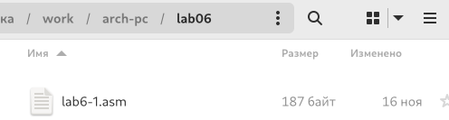{#fig:001 width=100%}

2. Вводим в файл lab6-1.asm текст программы из данного листинга 6.1 (рис. @fig:002).

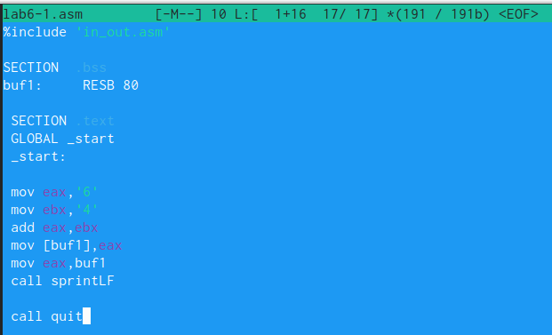{#fig:002 width=70%}

В программе в регистр eax записывается символ 6 ('6'), в ebx - 4 ('4'). Далее значения складываютcя, результат сложения записывается в регистр eax. Для вывода результата при помощи команды sprintLF необходимо, чтобы в регистре eax был записан адрес, для этого используем дополнительную переменную buf1.

Создаём исполняем файл и проверяем его работу (рис. @fig:003).

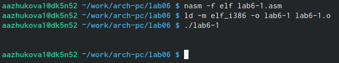{#fig:003 width=70%}

При выводе программы отображается символ j, так как программа выводит символ, соотвествующий сумме двоичных кодов символа 4 и 6 по системе ASCII.

3. Изменяем текст программы и вместо символов ('4' и '6'), запишем в регистры числа (4 и 6) (рис. @fig:004)

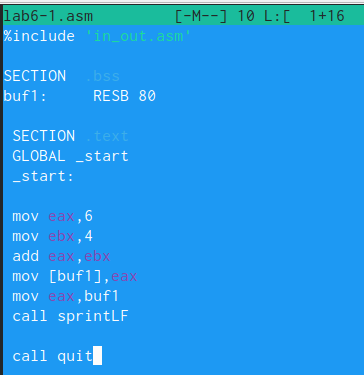{#fig:004 width=70%}

Создаём исполняемый файл и запускаем его (рис. @fig:005).

{#fig:005 width=70%}

Теперь выводится символ с кодом 10 - перевод строки. Этот символ выводится на экран пустой строкой.

4. Создаём новый файл lab6-2.asm при помощи команды touch (рис. @fig:006).

{#fig:006 width=70%}

Вводим в него текст программы для вывода значения регистра eax (рис. @fig:007).

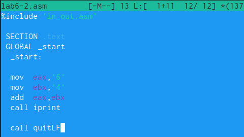{#fig:007 width=70%}

Создаём и запускаем исполняемый файл (рис. @fig:008).

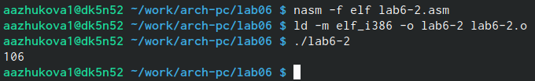{#fig:008 width=70%}

Программа выводит число 106, так как программа выводит сумму кодов символов '4' и '6'. Однако функция iprintLF позволяет вывести на экран число, а не символ, кодом которого является это число.

5. Заменяем символы на числа в тексте программы файла lab6-2.asm (рис. @fig:009).

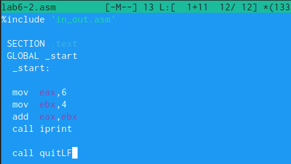{#fig:009 width=70%}

Теперь программа складывает не коды, соответсвующие символам, а сами числа, поэтому мы получаем вывод 10.

Заменяем в тексте программы функцию iprintLF на iprint (рис. @fig:010).

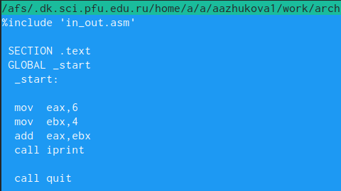{#fig:010 width=70%}

Далее создаём и запускаем исполняемый файл (рис. @fig:011).

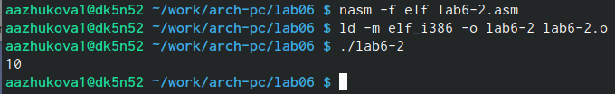{#fig:011 width=65%}

## Выполнение арифметических операций в NASM

6. Создадим файл lab6-3.asm в каталоге ~/work/arch-pc/lab06 и введем в него текст листинга 6.3 (рис. @fig:012).

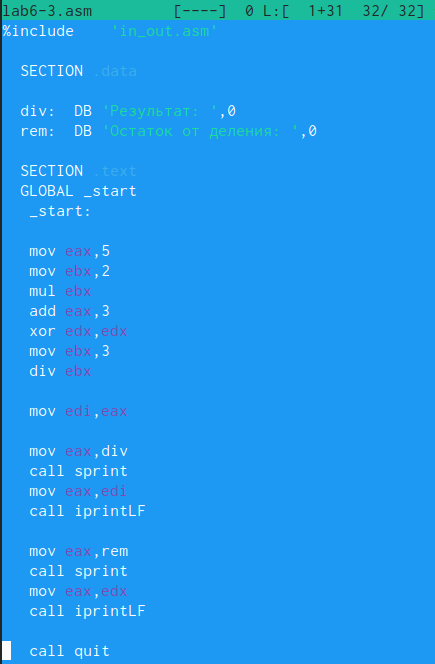{#fig:012 width=70%}

Создаём исполняемый файл и запускаем его (рис. @fig:013).

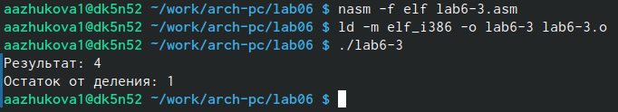{#fig:013 width=70%}

Изменим текст программы для вычисления выражения $$𝑓(𝑥) = (4 ∗ 6 + 2)/5$$ (рис. @fig:014).

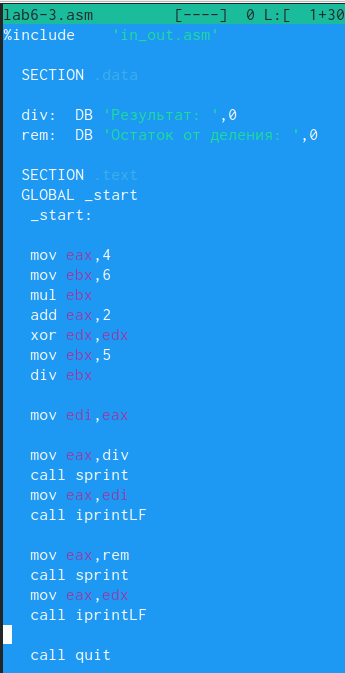{#fig:014 width=70%}

Создаём исполняемый файл и проверяем его работу (рис. @fig:015).

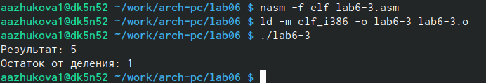{#fig:015 width=70%}

7. Рассмотрим программу вычисления варианта задания по номеру студенческого билета, работающую по следующему алгоритму:

• вывести запрос на введение № студенческого билета

• вычислить номер варианта по формуле: $$(𝑆𝑛 mod 20) + 1$$, где Sn – номер студенческого билета (В данном случае a mod b – это остаток от деления a на b).

• вывести на экран номер варианта.

Создаём файл variant.asm в каталоге ~/work/arch-pc/lab06, вводим текст листинга 6.4 в файл variant.asm (рис. @fig:016).

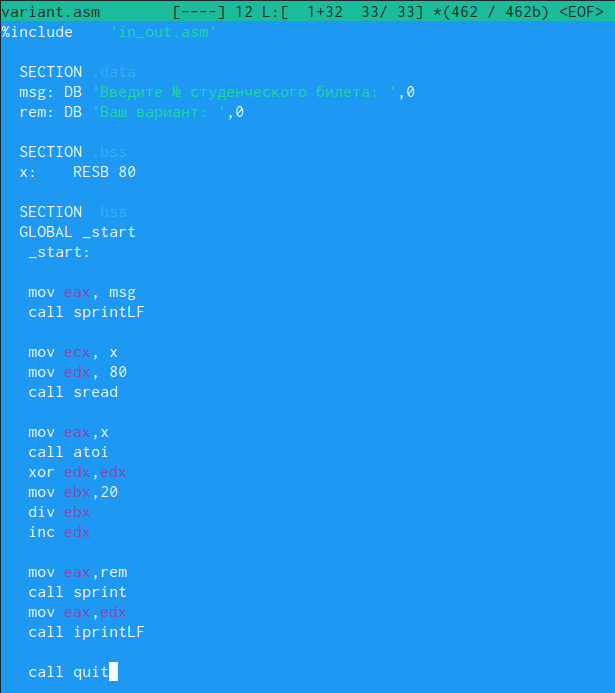{#fig:016 width=70%}

Создаём исполняемый файл и запустим его (рис. @fig:017).

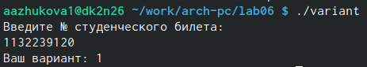{#fig:017 width=70%}

### Ответы на вопросы

1. За вывод на экран сообщения ‘Ваш вариант:’ отвечают строки: 

```NASM
mov eax,rem
call sprint 
```

2. Данные инструкции используются для:
mov ecx, x - адрес вводимой строки x вкладывается в регистр ecx
mov edx, 80 - запись в регистр 
call sread вызов подпрограммы из внешнего файла, обеспечивающий ввод данных с клавиатуры.
3. call atoi используется для вызова подпрограммы из внешнего файла, который преобразует ascii-код символа в целое числои записывает результат в регистр. 
4. За вычисление варианта отвечают строки:

```NASM
xor edx,edx
mov ebx,20
div ebx
inc edx
```

5. При выполнении инструкции div ebx остаток от деления записывается в регистр edx.
6. Инструкция inc edx увеличивает значение регистра edx на 1.
7. За вывод на экран результата вычислений отвечает строки:
```NASM
mov eax,edx
call iprintLF
```
## Выполнение заданий для самостоятельной работы

Создаём файл zadanie.asm и вводим в него текст программы для вычисления выражения $$𝑦 = (10 + 2𝑥)/3$$. Программа должна выводить выражение для вычисления, выводить запрос на ввод значения x, вычислять заданное выражение в зависимости от введенного x, выводить результат вычислений (рис. @fig:018).

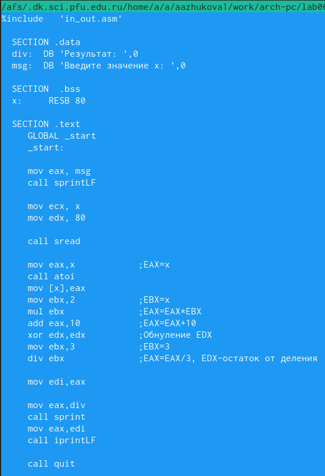{#fig:018 width=70%}

Создаём исполняемый файл и запустим его (рис. @fig:019).

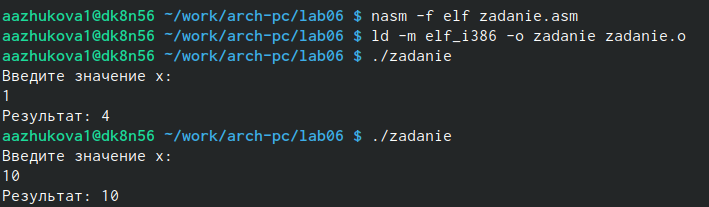{#fig:019 width=70%}

# Выводы

При выполнении данной лабораторной работы нами были освоены арифметические инструкции языка ассемблера NASM.

# Список литературы{.unnumbered}

::: {#refs}
:::
