---
## Front matter
title: "Лабораторная работа №7"
subtitle: " Команды безусловного и условного переходов в Nasm. Программирование ветвлений."
author: "Жукова Арина Александровна"

## Generic otions
lang: ru-RU
toc-title: "Содержание"

## Bibliography
bibliography: bib/cite.bib
csl: pandoc/csl/gost-r-7-0-5-2008-numeric.csl

## Pdf output format
toc: true # Table of contents
toc-depth: 2
lof: true # List of figures
lot: true # List of tables
fontsize: 12pt
linestretch: 1.5
papersize: a4
documentclass: scrreprt
## I18n polyglossia
polyglossia-lang:
  name: russian
  options:
	- spelling=modern
	- babelshorthands=true
polyglossia-otherlangs:
  name: english
## I18n babel
babel-lang: russian
babel-otherlangs: english
## Fonts
mainfont: PT Serif
romanfont: PT Serif
sansfont: PT Sans
monofont: PT Mono
mainfontoptions: Ligatures=TeX
romanfontoptions: Ligatures=TeX
sansfontoptions: Ligatures=TeX,Scale=MatchLowercase
monofontoptions: Scale=MatchLowercase,Scale=0.9
## Biblatex
biblatex: true
biblio-style: "gost-numeric"
biblatexoptions:
  - parentracker=true
  - backend=biber
  - hyperref=auto
  - language=auto
  - autolang=other*
  - citestyle=gost-numeric
## Pandoc-crossref LaTeX customization
figureTitle: "Рис."
tableTitle: "Таблица"
listingTitle: "Листинг"
lofTitle: "Список иллюстраций"
lotTitle: "Список таблиц"
lolTitle: "Листинги"
## Misc options
indent: true
header-includes:
  - \usepackage{indentfirst}
  - \usepackage{float} # keep figures where there are in the text
  - \floatplacement{figure}{H} # keep figures where there are in the text
---

# Цель работы

Цель данной лабораторной работы изучить команды условного и безусловного переходов, приобрести навыки написания программ с использованием переходов, познакомство с назначением и структурой файла листинга.

# Выполнение лабораторной работы

## Реализация переходов в NASM

1. Создадим файлы lab7-1.asm в каталоге для программ лабораторной работы №7 (рис. @fig:001).

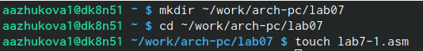{#fig:001 width=100%}

2. Введём в файл lab7-1.asm текст программы из листинга 7.1 (рис. @fig:002).

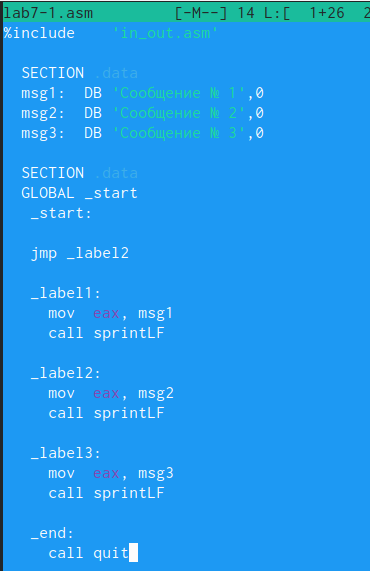{#fig:002 width=70%}

Создаём исполняемый файл и проверяем его работу (рис. @fig:003).

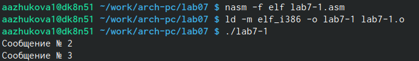{#fig:003 width=70%}

Изменение текста программы файла так, чтобы программа сначала ‘Сообщение № 2’, потом ‘Сообщение № 1’ и завершала работу (рис. @fig:004).

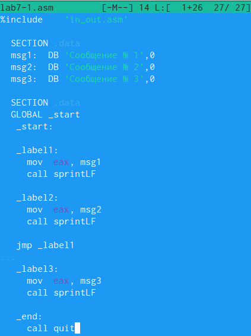{#fig:004 width=70%}

Создание исполняемого файла и проверка его работы (рис. @fig:005).

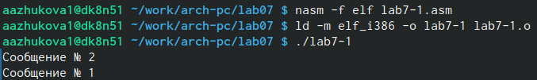{#fig:005 width=70%}

Изменим текст программы так, чтобы программа сначала ‘Сообщение № 3’, ‘Сообщение № 2’, потом 'Сообщение № 1' и завершала работу (рис. @fig:006).

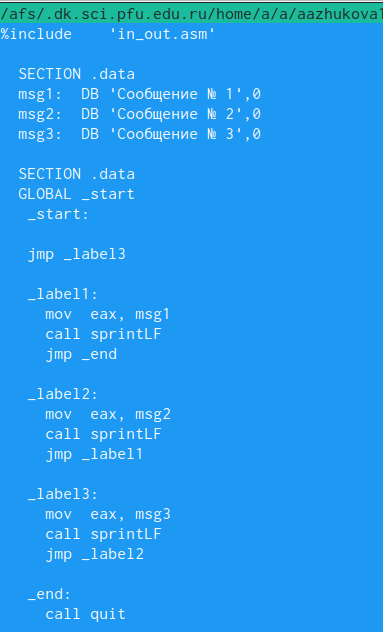{#fig:006 width=70%}

Создание исполняемого файла и проверка его работы (рис. @fig:007).

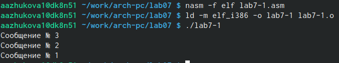{#fig:007 width=100%}

3. Создадим файл lab7-2.asm в каталоге ~/work/arch-pc/lab07. Введём текст программы из листинга 7.3 в lab7-2.asm (рис. @fig:008).

{#fig:008 width=100%}

Проверим работу программы, введя различные значения B (рис. @fig:009).

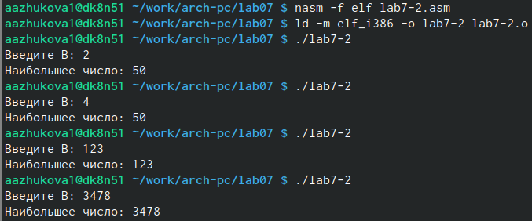{#fig:009 width=100%}

## Изучение структуры файлы листинга

4. Создадим файл листинга для программы из файла lab7-2.asm, указав ключ -l и задав имя файла листинга в командной строке (рис. @fig:010).

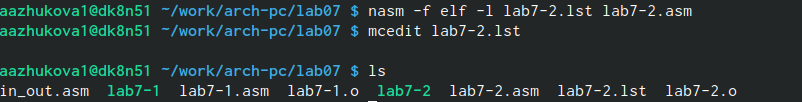{#fig:010 width=100%}

Опишем приведенные на рисунке 2.11 строки (рис. @fig:011).

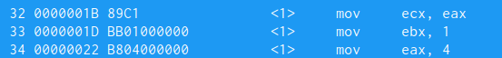{#fig:011 width=100%}

1) 32 - номер строки файла листинга, 0000001В - адрес (смещение машинного кода от начала текущего сегмента), 89C1 - машинный код, представляющая собой ассемблированную исходную строку в виде шестнадцатеричной последовательности, mov ecx, eax - исходный тест программы (приравнивающий значение ecx к eax). 

2) 33 - номер строки файла листинга, 0000001D - адрес (смещение машинного кода от начала текущего сегмента), 8BB01000000 - машинный код, представляющая собой ассемблированную исходную строку в виде шестнадцатеричной последовательности, mov ebx, 1 - исходный тест программы (приравнивающий значение ebx к 1).

3) 34 - номер строки файла листинга, 00000022- адрес (смещение машинного кода от начала текущего сегмента), 8B804000000 - машинный код, представляющая собой ассемблированную исходную строку в виде шестнадцатеричной последовательности, mov ebx, 1 - исходный тест программы (приравнивающий значение eax к 4).

## Задания для самостоятельной работы
1. Программа нахождения наименьшей из 3 целочисленных переменных a, b и c.

```NASM
%include 'in_out.asm'
section        .data
   msg  db "Наибольшее число: ",0h
   msgA db "Введите a: ",0h
   msgB db "Введите b: ",0h
   msgC db "Введите c: ",0h
section .bss
   max resb 10
   A   resb 10
   B   resb 10
   C   resb 10
section        .text
   global _start
_start:
; ------- Ввод A, B, C --------
   mov eax,msgA
   call sprint
   
   mov eax,A
   mov edx,10
   call sread
   
   mov eax,msgB
   call sprint
   
   mov ebx,B
   mov edx,10
   call sread
   
   mov eax,msgC
   call sprint
   
   mov ecx,C
   mov edx,10
   call sread
; -------- Преобразование ---------
   mov eax,B
   call atoi
   mov [B],eax
; -------- Записываем А в перенную  max --------
   mov ecx,[A]
   mov [max],ecx ; max = A
; ------- Сравниваем A и C -------------
   cmp ecx,[C]
   jg check_B
   mov ecx,[C]
   mov [max],ecx

check_B:
   mov eax,max
   call atoi
   mov [max],eax
   
   mov ecx,[max]
   cmp ecx,[B]
   jg  fin
   mov ecx,[B]
   mov [max],ecx
   
fin:
   mov eax, msg
   call sprint
   mov eax,[max]
   call iprintLF
   call quit
```

Результат (рис. @fig:012).

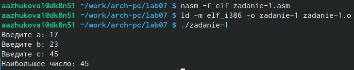{#fig:012 width=70%}

2. Программа, которая для введенных с клавиатуры значений x и a вычисляет значение заданной функции f(x) и выводит результат вычислений (2a − x, x < a, 8, x ≥ a).

```NASM
%include 'in_out.asm'
section        .data
   result_msg  db "Результат: ",0h
   msgA db "Введите a: ",0h
   msgX db "Введите x: ",0h
section .bss
   a   resb 10
   x   resb 10
   result resd 1
section        .text
   global _start
_start:
; ------- Ввод A  --------
   mov eax,msgA
   call sprint
   
   mov ecx,a
   mov edx,10
   call sread
   
; ------- Преобразование A ------
   mov eax,a
   call atoi 
   mov [a],eax
   
; ------- Ввод X ------------
   mov eax,msgX
   call sprint
   
   mov ecx,x
   mov edx,10
   call sread
   
; -------- Преобразование X ---------
   mov eax,x
   call atoi
   mov [x],eax
   
; --------- Сравнение ---------
   mov eax, [a]
   cmp eax, [x]
   jge  less_A
   
   mov eax, result_msg
   call sprint
   mov eax,8
   call iprintLF
   call quit
   
less_A:
   mov eax,[a]
   mov ebx,2
   mul ebx
   sub eax, [x]
   mov [result], eax
   
   mov eax, result_msg
   call sprint
   mov eax, [result]
   call iprintLF
   
   call quit
```

Результат (рис. @fig:013).

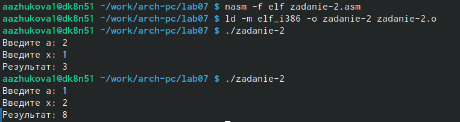{#fig:013 width=70%}

# Выводы

Нами были изучены команды условного и безусловного переходов, приобретены навыки написания программ с использованием переходов, мы познакомились с назначением и структурой файла листинга.


# Список литературы{.unnumbered}

::: {#refs}
:::
