---
## Front matter
title: "Лабораторная работа №8"
subtitle: "Программирование цикла. Обработка аргументов командной строки"
author: "Жукова Арина Александровна"

## Generic otions
lang: ru-RU
toc-title: "Содержание"

## Bibliography
bibliography: bib/cite.bib
csl: pandoc/csl/gost-r-7-0-5-2008-numeric.csl

## Pdf output format
toc: true # Table of contents
toc-depth: 2
lof: true # List of figures
lot: true # List of tables
fontsize: 12pt
linestretch: 1.5
papersize: a4
documentclass: scrreprt
## I18n polyglossia
polyglossia-lang:
  name: russian
  options:
	- spelling=modern
	- babelshorthands=true
polyglossia-otherlangs:
  name: english
## I18n babel
babel-lang: russian
babel-otherlangs: english
## Fonts
mainfont: PT Serif
romanfont: PT Serif
sansfont: PT Sans
monofont: PT Mono
mainfontoptions: Ligatures=TeX
romanfontoptions: Ligatures=TeX
sansfontoptions: Ligatures=TeX,Scale=MatchLowercase
monofontoptions: Scale=MatchLowercase,Scale=0.9
## Biblatex
biblatex: true
biblio-style: "gost-numeric"
biblatexoptions:
  - parentracker=true
  - backend=biber
  - hyperref=auto
  - language=auto
  - autolang=other*
  - citestyle=gost-numeric
## Pandoc-crossref LaTeX customization
figureTitle: "Рис."
tableTitle: "Таблица"
listingTitle: "Листинг"
lofTitle: "Список иллюстраций"
lotTitle: "Список таблиц"
lolTitle: "Листинги"
## Misc options
indent: true
header-includes:
  - \usepackage{indentfirst}
  - \usepackage{float} # keep figures where there are in the text
  - \floatplacement{figure}{H} # keep figures where there are in the text
---

# Цель работы

Приобретение навыков написания программ с использованием циклов и обработкой аргументов командной строки.

# Выполнение лабораторной работы

## Реализация циклов в NASM

Создаём каталог для программам лабораторной работы № 8, перейдём в него и создаём файл lab8-1.asm. Введём в него текст программы из листинга 8.1 (рис. @fig:001).

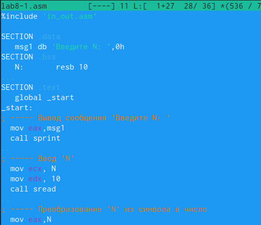{#fig:001 width=70%}

Создаём исполняемый файл и проверяем его работу (рис. @fig:002).

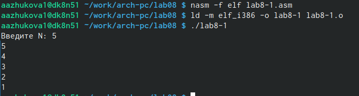{#fig:002 width=70%}

Внесем изменения в некоторые строки текста программы (рис. @fig:003).

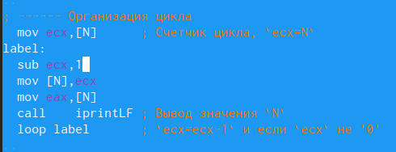{#fig:003 width=70%}

Число проходов цикла не соответствует значению N, введённого с клавиатуры.

Внесём изменение в строки программы, введя команды push и pop (добавления в стек и извлечения из стека) для сохранения значения счетчика цикла (рис. @fig:004).

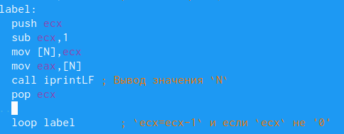{#fig:004 width=70%}

Создаём исполняемый файл и проверяем его работу (рис. @fig:005).

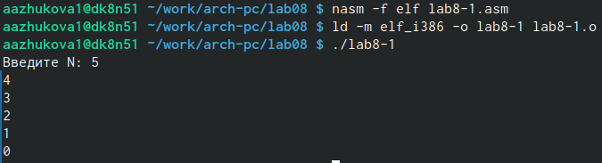{#fig:005 width=70%}

В данном случае число прохлдов цикла совпадает со значением N, введёному с клавиатуры.

## Обработка аргументов командной строки

Создадим файл lab8-2.asm в каталоге ~/work/arch-pc/lab08 и введём в него текст программы из листинга 8.2 (рис. @fig:006).

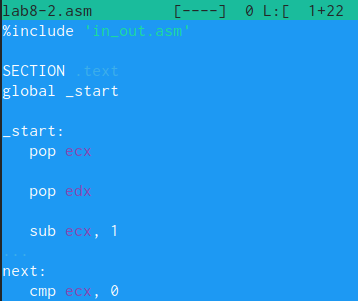{#fig:006 width=70%}

Создадим исполняемый файл и запустим его, указав аргументы: аргумент1 аргумент 2 'аргумент 3 (рис. @fig:007).

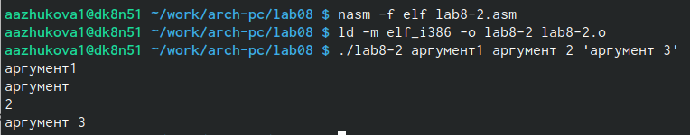{#fig:007 width=70%}

Программой было обработано 4 аргумента.

Создадим файл lab8-3.asm в каталоге ~/work/arch-pc/lab08 и введём в него текст программы из листинга 8.3 (рис. @fig:008).

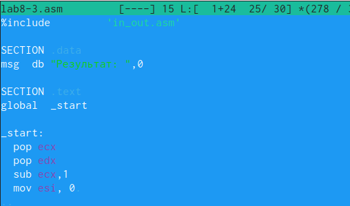{#fig:008 width=70%}

Создадим исполняемый файл и проверим его работу, указав аргумент (рис. @fig:009).

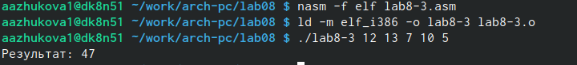{#fig:009 width=100%}

Изменим текст программы из листинга 8.3 для вычисления произведения аргументов командной строки (рис. @fig:010).

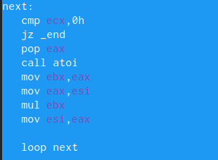{#fig:010 width=70%}

Проверим работу программы (рис. @fig:011).

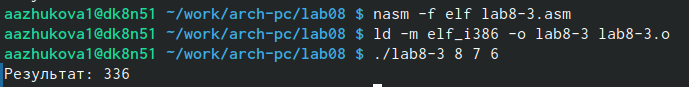{#fig:011 width=100%}

Для корректной работыы программы изменим значение esi на 1, в ebx вписываем значение аргумента, в eax значение того на что умножается, перемножаем ebx и eax, записываем полученное в esi.

# Задания для самостоятельной работы

Программа, которая находит сумму значений функции f(x) для x = x1, x2, ..., xn, т.е. программа должна выводить значение f(x1) + f(x2) + ... + f(xn). Значения xi передаются как аргументы. f(x) = 2x + 15
 
```NASM
%include       'in_out.asm'

SECTION .data
msg  db "Результат: ",0

SECTION .text
global  _start

_start:
   pop ecx
   pop edx
   sub ecx, 1
   mov esi, 0

next:
   cmp ecx, 0h
   jz _end
   
   pop eax
   call atoi
   mov ebx,2
   mul ebx
   add eax,15
   add esi,eax
   loop next

_end:
   mov eax,msg
   call sprint
   mov eax,esi
   call iprintLF
   call quit
```

Создадим исполняемый файл и проверим его работу (рис. @fig:012).

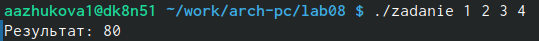{#fig:012 width=100%}

# Выводы

В ходе выполнения лабораторной работы мы приобрели навыки написания программ с использованием циклов и обработкой аргументов командной строки.

# Список литературы{.unnumbered}

::: {#refs}
:::
