---
## Front matter
title: "Лаборатрная работа №9"
subtitle: " Понятие подпрограммы. Отладчик GDB."
author: "Жукова Арина Александровна"

## Generic otions
lang: ru-RU
toc-title: "Содержание"

## Bibliography
bibliography: bib/cite.bib
csl: pandoc/csl/gost-r-7-0-5-2008-numeric.csl

## Pdf output format
toc: true # Table of contents
toc-depth: 2
lof: true # List of figures
lot: true # List of tables
fontsize: 12pt
linestretch: 1.5
papersize: a4
documentclass: scrreprt
## I18n polyglossia
polyglossia-lang:
  name: russian
  options:
	- spelling=modern
	- babelshorthands=true
polyglossia-otherlangs:
  name: english
## I18n babel
babel-lang: russian
babel-otherlangs: english
## Fonts
mainfont: PT Serif
romanfont: PT Serif
sansfont: PT Sans
monofont: PT Mono
mainfontoptions: Ligatures=TeX
romanfontoptions: Ligatures=TeX
sansfontoptions: Ligatures=TeX,Scale=MatchLowercase
monofontoptions: Scale=MatchLowercase,Scale=0.9
## Biblatex
biblatex: true
biblio-style: "gost-numeric"
biblatexoptions:
  - parentracker=true
  - backend=biber
  - hyperref=auto
  - language=auto
  - autolang=other*
  - citestyle=gost-numeric
## Pandoc-crossref LaTeX customization
figureTitle: "Рис."
tableTitle: "Таблица"
listingTitle: "Листинг"
lofTitle: "Список иллюстраций"
lotTitle: "Список таблиц"
lolTitle: "Листинги"
## Misc options
indent: true
header-includes:
  - \usepackage{indentfirst}
  - \usepackage{float} # keep figures where there are in the text
  - \floatplacement{figure}{H} # keep figures where there are in the text
---

# Цель работы

Приобретение навыков написания программ с использованием подпрограмм. Знакомство с методами отладки при помощи GDB и его основными возможностями.

# Выполнение лабораторной работы

## Реализация подпрограмм в NASM

Создаём файл с текстом программы из листинга 9.1, создаём исполняеый файл и проверяем его работу (рис. @fig:001).

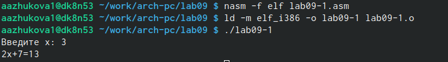{#fig:001 width=70%}

Изменим текст программы, добавив подпрограмму _subcalcul в подпрограмму _calcul.

```NASM
_calcul:
call _subcalcul
mov ebx,2
mul ebx
add eax,7
mov [res],eax

ret ; Выход из попрограммы
;Подпрограмма для вычисления выражения "3x-1"
_subcalcul:
mov ebx,3
mul ebx
sub eax,1
mov [res],eax

ret ; выход из подпрограммы
```

Проверим работу программы (рис. @fig:002).

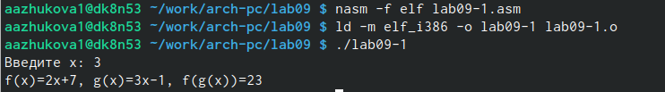{#fig:002 width=70%}

## Отладка программам с помощью GDB

Создаём файл ab09-2.asm с текстом программы из Листинга 9.2. Получаем исполняемый файл, для работы с GDB добавляем отладочную информацию при помощи ключа '-g' (рис. @fig:003).

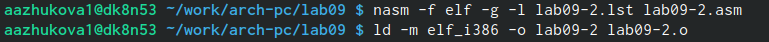{#fig:003 width=70%}

Загружаем исполняемый файл в отладчик gbd, проверяем работу программы в оболочке GBD при помощи команды run (рис. @fig:004-@fig:005).

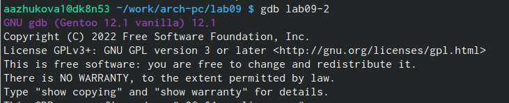{#fig:004 width=70%}

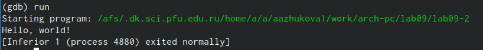{#fig:005 width=70%}

Устанавливаем брейкпоинт на метку _start, для более подробного анализа программы, и запускаем файл (рис. @fig:006).

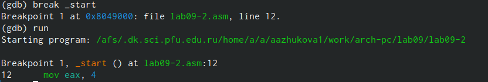{#fig:006 width=70%}

Просматриваем дисассимилированный код программы с помощью команды disassemble начиная с метки _start (рис. @fig:007).

{#fig:007 width=70%}

Переключаемся на отображение команд с Intel’овским синтаксисом (рис. @fig:008).

{#fig:008 width=70%}

Intel’овский синтаксис отличается от синтаксиса ATT:

1) порядком операндов, в ATT сначала идёт источник затем приёмник;

2) имена регистров начинается с %, а название переменной с $;

3) числовые константы имеют знак $ в начале.

Включаем режим псевдографики для более удобного анализа программы, введя команды layout asm и layout regs (рис. @fig:009).

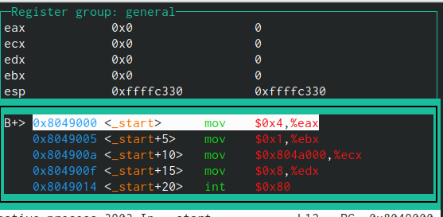{#fig:009 width=70%}

## Добавление точек останова

Проверим установку точки останова с помощью команды info breakpoints (рис. @fig:010).

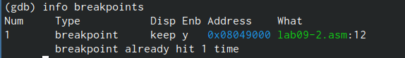{#fig:010 width=70%}

Установим ещё одну точку останова по адресу инструкции, просмотрим информацию по всем установленным точкам (рис. @fig:011).

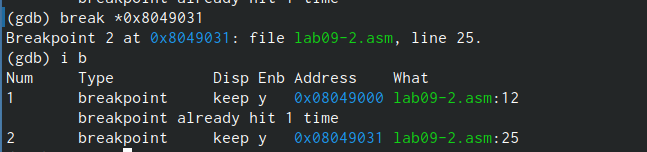{#fig:011 width=70%}

## Работа с данными программы в GDB

Просмотрим содержимое регистров при помощи команды info registers (рис. @fig:012).

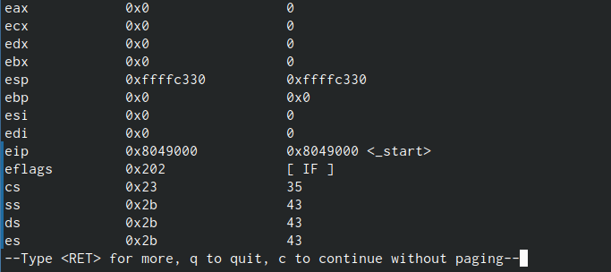{#fig:012 width=70%}

Посмотрим значение переменной msg1 по имени (рис. @fig:013).

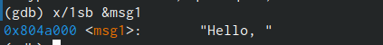{#fig:013 width=70%}

Посмотрим значение переменной msg2 по адресу (рис. @fig:014).

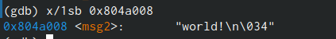{#fig:014 width=70%}

Изменим значение переменной msg1 при помощи команды set (рис. @fig:015).

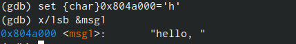{#fig:015 width=70%}

Заменим первый символ во второй переменной msg2 на K (рис. @fig:016).

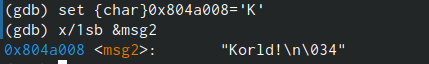{#fig:016 width=70%}

Выведем в различных форматах (в шестнадцатеричном формате, в двоичном формате и в символьном виде) значение регистра edx (рис. @fig:017).

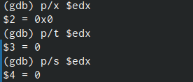{#fig:017 width=70%}

Изменим значение регистра ebx при помощи команды set (рис. @fig:018).

{#fig:018 width=70%}

В первом случае мы меняем значение регистра на символ '2',  и нам выводится значение 50 в соответствие с таблицей ASCII, а во втором знвчение меняется на цифру 2.

## Обработка аргументов командной строки в GDB

Скопируем файл lab8-2.asm, созданный при выполнении лабораторной работы №8, с программой выводящей на экран аргументы командной строки (Листинг 8.2) в файл с именем lab09-3.asm (рис. @fig:019).

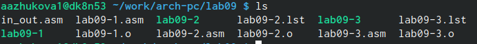{#fig:019 width=80%}

Создадим исполняемый файл (рис. @fig:020).

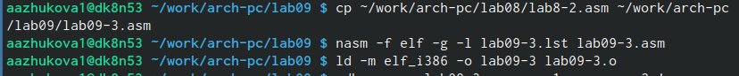{#fig:01 width=70%}

Загрузим исполняемый файл в отладчик, указав аргументы, при помощи ключа --args (рис. @fig:021).

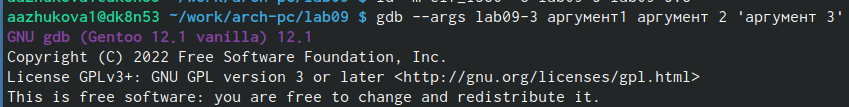{#fig:021 width=70%}

Установим точку останова перед первой инструкцией в программе и запустим ее (рис. @fig:022).

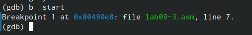{#fig:022 width=70%}

Просмотрим позиции стека (рис. @fig:023).

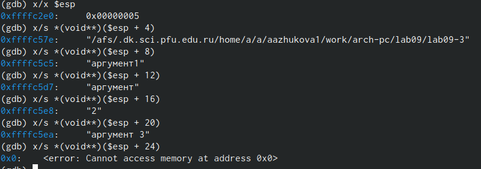{#fig:023 width=70%}

Шаг изменения адреса равен 4 потому, что на каждое значение в памяти выделяется 4 байта.

# Задания для самостоятельной работы

1. Преобразуйте программу из лабораторной работы №8 (Задание №1 для самостоятельной работы), реализовав вычисление значения функции 𝑓(𝑥) как подпрограмму.

Копируем файл задания №1 для самостоятельной работы в папку с заданиями лабораторной работы под именем zadanie1.asm (рис. @fig:024).

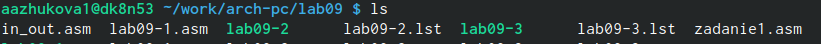{#fig:023 width=70%}

Изменяем текст программы так, чтобы вычисление значения функции f(x) вычислялась как подпрограмма (изменённая часть).

```NASM
next:
   cmp ecx, 0h
   jz _end
   pop eax
   call atoi
   call _calcul
   loop next 
_end:
   mov eax,msg
   call sprint
   mov eax,esi
   call iprintLF
   call quit
_calcul:
   mov ebx,2
   mul ebx
   add eax,15
   add esi,eax
   ret
```

Создаём исполняемый файл и проверяем корректность работы программы (рис. @fig:024).

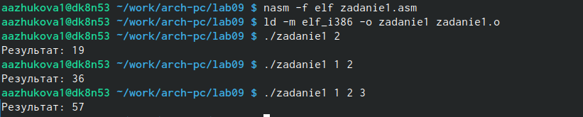{#fig:024 width=70%}

2. В листинге 9.3 приведена программа вычисления выражения (3 + 2) ∗ 4 + 5. При запуске данная программа дает неверный результат. Проверьте это. С помощью отладчика GDB, анализируя изменения значений регистров, определите ошибку и исправьте ее.

Создаём файл zadanie2.asm и вносим в него текст листинга 9.3. Создаём исполняемый файл, добавляя в него отладоточную информацию, проверяем корректность работы программы. Выводиться неверный ответ (Результат: 10), верный (Результат: 29) (рис. @fig:025).

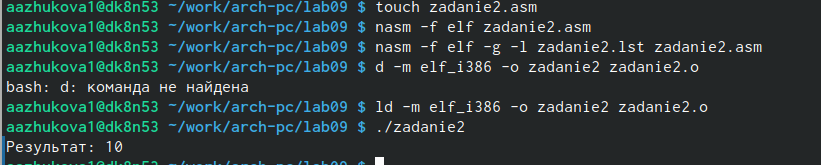{#fig:025 width=70%}

Исправим ошибку в прграмме с помощью отладчика GDB,анализируя изменения значений регистров 

Правильная часть кода.

```NASM
mov ebx,3   
mov eax,2
add ebx,eax
mov eax,ebx
mov ecx,4
mul ecx
add eax,5
mov edi,eax
```

Проверим корректность работы программы (рис. @fig:026)

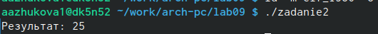{#fig:026 width=70%}

# Выводы

В ходе выполнения лабораторной работы мы приобрели навыки написания программ с использованием подпрограмм, познакомтлтсб с методами отладки при помощи GDB и его основными возможностями.

# Список литературы{.unnumbered}

::: {#refs}
:::
