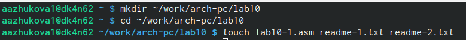
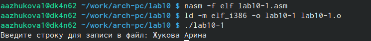
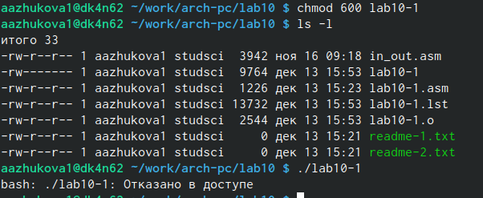
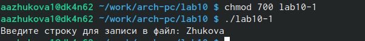
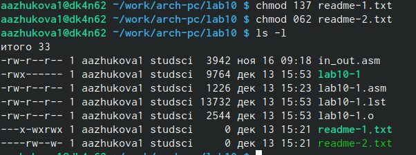
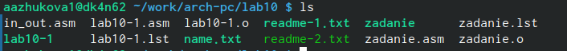
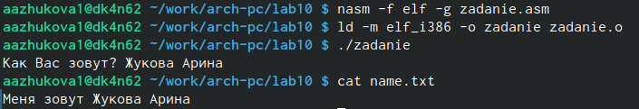

---
## Front matter
title: "Лабораторная работа №10."
subtitle: "Работа с файлами средствами Nasm"
author: "Жукова Арина Александровна"

## Generic otions
lang: ru-RU
toc-title: "Содержание"

## Bibliography
bibliography: bib/cite.bib
csl: pandoc/csl/gost-r-7-0-5-2008-numeric.csl

## Pdf output format
toc: true # Table of contents
toc-depth: 2
lof: true # List of figures
lot: true # List of tables
fontsize: 12pt
linestretch: 1.5
papersize: a4
documentclass: scrreprt
## I18n polyglossia
polyglossia-lang:
  name: russian
  options:
	- spelling=modern
	- babelshorthands=true
polyglossia-otherlangs:
  name: english
## I18n babel
babel-lang: russian
babel-otherlangs: english
## Fonts
mainfont: PT Serif
romanfont: PT Serif
sansfont: PT Sans
monofont: PT Mono
mainfontoptions: Ligatures=TeX
romanfontoptions: Ligatures=TeX
sansfontoptions: Ligatures=TeX,Scale=MatchLowercase
monofontoptions: Scale=MatchLowercase,Scale=0.9
## Biblatex
biblatex: true
biblio-style: "gost-numeric"
biblatexoptions:
  - parentracker=true
  - backend=biber
  - hyperref=auto
  - language=auto
  - autolang=other*
  - citestyle=gost-numeric
## Pandoc-crossref LaTeX customization
figureTitle: "Рис."
tableTitle: "Таблица"
listingTitle: "Листинг"
lofTitle: "Список иллюстраций"
lotTitle: "Список таблиц"
lolTitle: "Листинги"
## Misc options
indent: true
header-includes:
  - \usepackage{indentfirst}
  - \usepackage{float} # keep figures where there are in the text
  - \floatplacement{figure}{H} # keep figures where there are in the text
---

# Цель работы

Приобретение навыков написания программ для работы с файлами.

# Выполнение лабораторной работы

1. Создаём файлы lab10-1.asm, readme-1.txt и readme-2.txt в каталоге для программ лабораторной работы №10 (рис. @fig:001).

{#fig:001 width=70%}

2. Вводим в файл lab10-1.asm текст программы из листинга 10.1. Создаём исполняемый файл и проверяем его работу (рис. @fig:002).

{#fig:002 width=70%}

3. Изменяем права доступа к исполняемому файлу lab10-1, запретив его выполнение, выполняем его (рис. @fig:003).

{#fig:003 width=70%}

4. С помощью команды chmod изменяем права доступа к файлу lab10-1.asm с исходным текстом программы, добавив права на исполнение, выполняем его (рис. @fig:004).

{#fig:004 width=70%}

5. В соответствии с вариантом в таблице 10.4 предоставляем права доступа к файлу readme-1.txt представленные в символьном виде, а для файла readme-2.txt – в двочном виде. Проверяем правильность выполнения с помощью команды ls -l (рис. @fig:005).

{#fig:005 width=70%}

# Задания для самостоятельной работы

1. Напишите программу работающую по следующему алгоритму:
• Вывод приглашения “Как Вас зовут?”
• ввести с клавиатуры свои фамилию и имя
• создать файл с именем name.txt
• записать в файл сообщение “Меня зовут”
• дописать в файл строку введенную с клавиатуры
• закрыть файл

```NASM
%include 'in_out.asm'

SECTION .data
filename db 'name.txt', 0h ; Имя файла
msg1 db 'Как Вас зовут? ', 0h ; Сообщение
msg2 db 'Меня зовут ', 0h

SECTION .bss
contents resb 255 ; переменная для вводимой строки

SECTION .text
   global _start
_start:

; --- Печать сообщения `msg`
mov eax,msg1
call sprintПриобретение навыков написания программ для работы с файлами.
; ---- Запись введеной с клавиатуры строки в `contents`
mov ecx, contents
mov edx, 255
call sread
; --- Создание файла
mov ecx, 0777o
mov ebx,filename
mov eax, 8
int 80h

; --- Открытие существующего файла (`sys_open`)
mov ecx, 2 ; открываем для записи (2)
mov ebx, filename
mov eax, 5
int 80h

; --- Запись дескриптора файла в `esi`
mov esi, eax
; --- Расчет длины введенной строки
mov eax, msg2     ; в `eax` запишется количество
call slen         ; введенных байтов
; --- Записывем в файл сообщение меня зовут
mov edx, eax
mov ecx, msg2
mov ebx, esi
mov eax, 4
int 80h
; --- Расчет длины введенной строки
mov eax, contents ; в `eax` запишется количество
call slen         ; введенных байтов
; --- Записываем в файл `contents` (`sys_write`)
mov edx, eax
mov ecx, contents
mov ebx, esi
mov eax, 4
int 80h
call quit
; --- Закрываем файл (`sys_close`)
mov ebx, esi
mov eax, 6
int 80h

call quit
```

Создадим исполняемый файл и проверим его работу. Проверить наличие файла и его
содержимое с помощью команд ls и cat (рис. @fig:006-@fig:007).

{#fig:006 width=70%}

{#fig:007 width=70%}

# Выводы

В ходе выполнения лабораторной работы мы приобрели навыки написания программ для работы с файлами.

# Список литературы{.unnumbered}

::: {#refs}
:::
